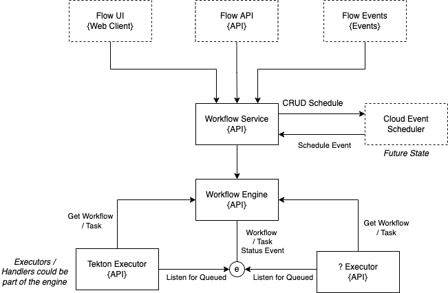

# Async vs Sync Mode

* **Status:** Proposed
* **Deciders:** Tyson Lawrie, Marcus Roy, _tbd_
* **Date:** 2022-10-08 (proposed)

## Context and Problem Statement

Prior to v4, the Workflow execution was completed via blocking syncrhonous calls to the Controller.

With v4 we have adjusted this to be asynchronous and tasks to be moved to a Queued state, prior to being dequeued and moved to Running by an external process (i.e. the Executor aka Controller).

We now have to approach what a default would be and whether asyncrhonous makes sense in all the scenarios or should we implemented a mode that can switch the system back to synchronous.

## Considered Options

### 1. New Mode
In async, Workflows and Tasks would have to be manually moved from Queued to Started to Completed.

In Syncrhonous mode, Workflows and Tasks would automatically move from Queued to Started and a synchronous outbound call from the engine would be made.

### 2. Synchronous Polling

An Executor, would continuously poll every x seconds to determine if there are any queued Workflows or Tasks that need processing.

### 3. Synchronous Event

An Executor, would listen for a Workflow / Task status event to determine if there are any queued Workflows or Tasks that need processing.

## Decision Outcome

_Proposed_ that we implement option 2 or 3 (or both as necessary if eventing is still a feature flag in its own right).

## Additional Context

